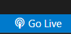
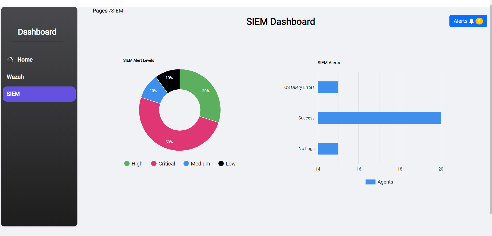
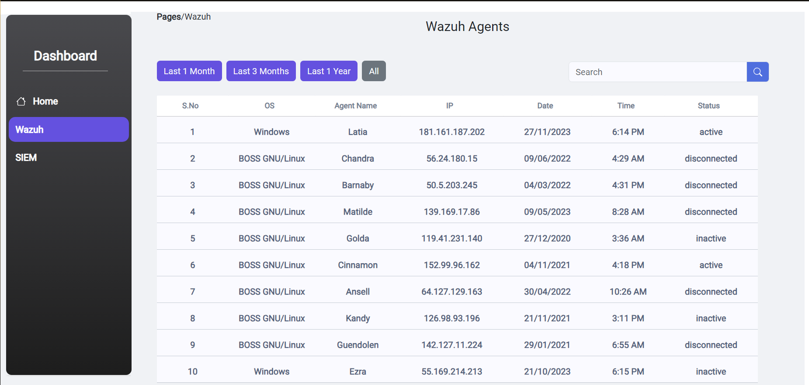
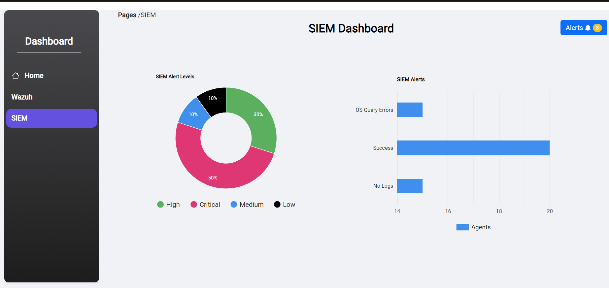

# A SIEM/Wazuh Dashboard Application `Using MERN Stack`.

#### Author : surya-mu


<h2>Steps to run the Application:</h2>

 1. Click on code </> dropdown and copy the .git url then use this command in your terminal.
```git
git clone [URL]
``` 


2. After it has cloned to your Device's directory do
 ```git 
cd CDAC-SIEM
``` 

3. Install all dependencies of the project using node.
```js
npm install
``` 
*If you don't have node.js installed in your device, go to [node](https://nodejs.org/en/download/current) and download the latest version.*

4. Ensure you have [Live Server](https://github.com/ritwickdey/vscode-live-server-plus-plus) Extension in your VSCode now click the **Go Live** Button

    

5. Select ``agent_details.json`` from the directory window.
    

Now a popup will be shown


6. Now you are ready,
 After setting up and following till Step 5, Do:
```
cd frontend
```
  and then run
```js
npm start
``` 
or
```
yarn dev
``` 
depending on terminal.

7. Check your `localhost:3000/` where the React Application is running.

8. Backend folder contains connection between **Node.js** and **Django Rest API** and also a json file hosted in a seperate file called **Agent_Details.json**.


<hr>

**Screenshots of the Project**







*This was a Project Made during my Internship at C-DAC**


